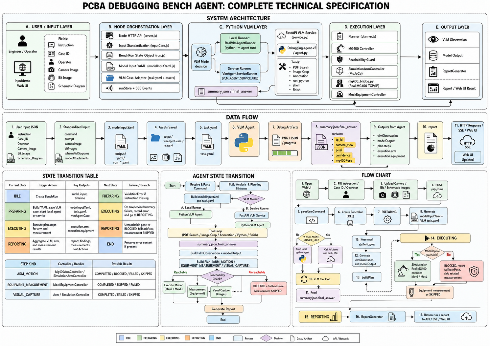

# 当前版本流程说明

本文说明 PCBA Debugging Bench Agent 当前版本的端到端流程、运行命令、服务端口和已知未完成内容。当前说明基于本仓库代码与现有流程图整理，部分硬件闭环仍处于初稿或待验证状态。

## 当前流程图



## 当前版本未完成内容

- 通讯方式还没有完全统一为以太网链路。当前 Node Web/API 到 Robot Gateway 使用 HTTP/JSON，Robot Gateway 再调用 MG400 TCP/IP 或仿真 Dashboard TCP；但部分历史脚本、配置和调试入口仍保留本地脚本调用方式，整体通讯边界还需要继续收敛。
- 语音输入转文字可能存在延迟。当前未针对语音链路做代码级检查和端到端延迟验证，因此不能把语音输入视为已经完成的稳定实时输入能力。
- VLM 输出坐标到实体 `x y z r` 的转换过程仍是初稿。当前代码优先读取 VLM `final_answer` 中的 `mg400Pose` / `mg400_pose` / `pose`；如果只有像素坐标，则会用临时映射生成 `{ x: pixelX, y: pixelY, z: 0, r: 0 }`。这还不是明确标定后的像素到实体 MG400 坐标转换方案，需要补充相机标定、板卡坐标系、机械臂坐标系和姿态定义。
- 实体机复位流程尚未完善。当前具备 MG400 连通性测试、状态查询和运动命令转发，但没有形成正式的实体机复位、回零、异常清除、复位后状态确认流程。
- VLM 服务和 Node 编排之间已有服务模式与 CLI fallback，但错误恢复、取消、重试和人工确认机制仍需要继续产品化。
- 量测设备当前主要通过 `MockEquipmentController` 表示，真实仪器通讯、采样、判定和报告闭环还没有完全接入。

## 当前系统流程

1. 操作员打开 Web UI，输入 `Instruction`、`Case ID`、`Operator`，并上传相机图、位号图和原理图等附件。
2. Node HTTP 服务接收 `POST /api/runs` 请求，通过 `inputCore` 统一解析输入字段，生成 `BenchRun` 状态对象。
3. 系统进入 `PREPARING` 状态，`VlmAgentCaseAdapter` 将输入文件整理为 Debugging-agent-v2 可读取的 case 目录和 `task.yaml`。
4. Node 编排层优先调用 Python FastAPI VLM Service。如果服务不可用，则走本地 Python CLI fallback runner。
5. Python VLM Agent 读取 `task.yaml`、图片、PDF 和工作流提示，执行测试点定位、图像裁剪、PDF/图像检索、标注和最终答案生成。
6. VLM 输出写入 `summary.json` / `final_answer`，其中包含测试点、像素坐标、置信度、相机视角，以及可能存在的 `mg400Pose`。
7. Node 读取 VLM 结果，生成 `vlmObservation` 和 `modelOutput`，再由 `vlmTargetExecutionMapper` 转换为执行计划。
8. 执行计划通常包含三类步骤：机械臂运动、设备量测、后置视觉采集。
9. 执行层先做 MG400 可达性检查。可达时通过 Robot Gateway 发送实体 MG400 或仿真控制命令；不可达时记录 `BLOCKED` 和 fallback pose，并跳过相关量测。
10. 执行结束后生成 report，并通过 HTTP response、run 查询接口和 SSE 事件返回给 Web UI。

## 运行命令与端口

### 安装依赖

```bash
npm install
```

如需直接运行 Python VLM Agent：

```bash
cd "Vlm agent/Debugging-agent-v2"
python -m venv .venv
.venv\Scripts\activate
pip install -r requirements.txt
```

### 启动 Node Web/API 服务

```bash
npm start
```

- 默认地址：`http://localhost:3000`
- 默认端口来源：`PORT`，未设置时为 `3000`
- 主要接口：
  - `GET /`：内置 Web UI
  - `GET /health`：健康检查
  - `POST /api/runs`：创建并执行一次调试任务
  - `GET /api/runs/:runId`：读取运行结果
  - `GET /api/runs/:runId/events`：读取或订阅 SSE 运行事件
  - `GET /api/mg400/config`：读取 MG400 配置
  - `POST /api/mg400/config`：更新 MG400 配置
  - `POST /api/mg400/test`：测试 MG400 连接
  - `GET /api/mg400/status`：读取 MG400 状态
  - `POST /api/mg400/command`：发送 MG400 命令
  - `GET /api/ethernet/info`：读取本机以太网适配器信息

### 启动 Robot Gateway

```bash
npm run robot-gateway
```

- 默认地址：`http://localhost:8010`
- 默认端口来源：`ROBOT_GATEWAY_PORT`，未设置时为 `8010`
- Node 编排层访问地址来源：`ROBOT_GATEWAY_URL`，未设置时为 `http://127.0.0.1:8010`
- 主要接口：
  - `GET /health`
  - `POST /v1/robot/execute`
  - `POST /v1/robot/:action`

### 启动 Python VLM Service

```bash
cd "Vlm agent/Debugging-agent-v2"
python -m uvicorn agent.service:app --host 127.0.0.1 --port 8000
```

- 默认地址：`http://127.0.0.1:8000`
- Node 编排层访问地址来源：`VLM_AGENT_SERVICE_URL`，未设置时为 `http://127.0.0.1:8000`
- 主要接口：
  - `GET /health`
  - `POST /v1/runs`
  - `GET /v1/runs/{run_id}`
  - `GET /v1/runs/{run_id}/events`
  - `POST /v1/runs/{run_id}/observations`
  - `POST /v1/runs/{run_id}/cancel`

如果不启动 Python VLM Service，Node 服务会尝试回退到本地 CLI runner。也可以设置 `VLM_AGENT_RUNNER=cli` 强制使用 CLI runner。

### 直接运行单个 VLM case

```bash
npm run vlm:case -- "Vlm agent/Debugging-agent-v2/data/cases/case_011/task.yaml"
```

也可以直接进入 VLM Agent 目录运行：

```bash
cd "Vlm agent/Debugging-agent-v2"
python -m agent run data/cases/case_011/task.yaml
```

### 测试

```bash
npm test
```

Python VLM Agent 测试：

```bash
cd "Vlm agent/Debugging-agent-v2"
python tests\test_unit.py
python tests\test_agent_e2e.py
```

## 关键环境变量

- `PORT`：Node Web/API 服务端口，默认 `3000`
- `ROBOT_GATEWAY_PORT`：Robot Gateway 监听端口，默认 `8010`
- `ROBOT_GATEWAY_URL`：Node 调用 Robot Gateway 的地址，默认 `http://127.0.0.1:8010`
- `VLM_AGENT_SERVICE_URL`：Node 调用 Python VLM Service 的地址，默认 `http://127.0.0.1:8000`
- `VLM_AGENT_RUNNER=cli`：强制 Node 使用 Python CLI runner
- `VLM_AGENT_DIR`：Debugging-agent-v2 目录
- `VLM_ENV_FILE`：VLM Agent 使用的 `.env` 文件路径
- `VLM_AGENT_MAX_STEPS`：VLM Agent 最大工具调用步数，默认 `80`
- `VLM_AGENT_TIMEOUT_MS`：Node 等待 VLM Agent 的超时时间
- `VLM_BASE_URL` / `VLM_API_KEY` / `VLM_MODEL`：真实 VLM 模型服务配置

## 建议后续收敛

1. 明确相机像素坐标、板卡坐标和 MG400 世界坐标之间的标定流程，并替换当前临时 `poseFromPixel` 逻辑。
2. 将真实仪器量测从 mock 接口替换为可配置的以太网或串口仪器适配器。
3. 为实体 MG400 增加复位、回零、急停恢复、异常清除和复位后状态确认接口。
4. 对语音输入链路做代码检查和端到端延迟测试，再决定是否纳入正式输入流程。
5. 统一通讯配置文档，明确哪些链路是 HTTP/JSON、MG400 TCP/IP、仿真 TCP 或本地进程调用。
