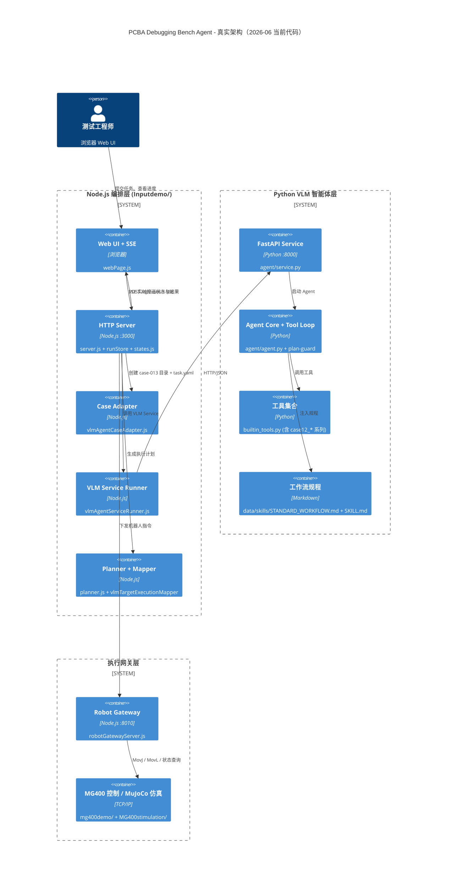
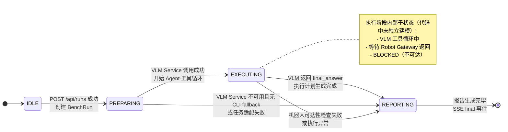
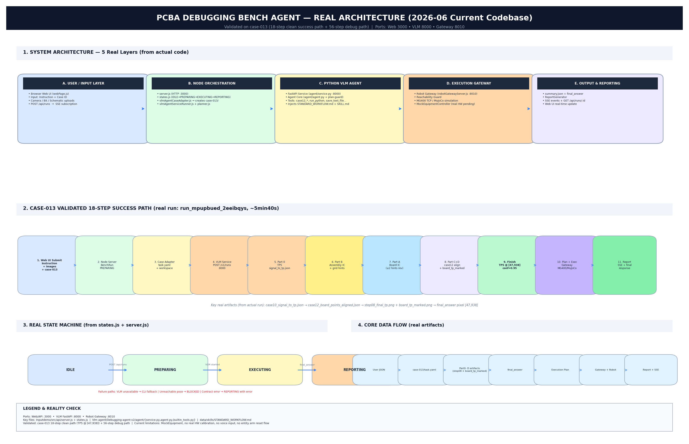

# PCBA Debugging Bench Agent — 真实架构与流程（基于 2026-06-01 当前代码）

> 本文档严格参照 **当前仓库实际存在的代码结构** 编写，剔除过时规划和未实现的模块。
> 所有图表均以真实运行过的 case-013（18步成功路径 + 56步调试路径）为验证依据。

---

## 一、文字概述（当前真实架构）

### 1.1 核心分层（实际存在的模块）

| 层级 | 技术栈 | 主要目录 / 文件 | 端口 | 职责 |
|------|--------|------------------|------|------|
| **用户交互层** | Node.js + 浏览器 | `Inputdemo/src/api/webPage.js` + 静态资源 | 3000 | Web UI，提交任务、展示进度、SSE 实时事件 |
| **编排控制层** | Node.js (ESM) | `Inputdemo/src/api/server.js`<br>`inputCore.js`<br>`vlmAgentCaseAdapter.js`<br>`vlmAgentServiceRunner.js` | 3000 | 接收请求、状态机（IDLE→PREPARING→EXECUTING→REPORTING）、创建 case 目录、调用 VLM Service、执行计划映射、SSE 推送 |
| **VLM 智能体层** | Python + FastAPI + OpenAI 兼容 | `Vlm agent/Debugging-agent-v2/agent/service.py`<br>`agent/agent.py`<br>`builtin_tools.py` | 8000 | 真正的“脑”。注入 `STANDARD_WORKFLOW.md` + `SKILL.md`，执行 Part 0→B→A→C→D（case12 工具链），产出 `step08_final_tp.png` + `board_tp_marked.png` |
| **执行网关层** | Node.js + TCP/IP | `Inputdemo/src/gateway/robotGatewayServer.js` | 8010 | 统一机器人控制入口，转发给真实 MG400 或 MuJoCo 仿真 |
| **硬件/仿真适配层** | Python / C++ SDK | `mg400demo/`<br>`MG400stimulation/`<br>Robot Gateway 内部 | - | 真实机械臂 TCP 指令、MuJoCo 仿真 |

### 1.2 当前已验证可跑通的完整链路（case-013 18步成功路径）

1. 浏览器 Web UI 提交（Instruction + 图片 + Case ID = case-013）
2. Node `server.js` 创建 `BenchRun`，状态 → `PREPARING`
3. `VlmAgentCaseAdapter` 在 `workspace/vlm-agent-runs/case-013/` 下生成目录 + `task.yaml`
4. 通过 HTTP 调用 VLM Service (`POST /v1/runs`)
5. Python Agent 读取 `STANDARD_WORKFLOW.md`，严格按 **Part 0 → Part B → Part A → Part C → Part D (case12)** 执行
6. 关键产物：
   - `case10_signal_to_tp.json`（TP5）
   - `case10_assembly_largest_ic_box.png` / `case10_largest_ic_box.png`
   - `case12_board_points_aligned.json`
   - `step08_final_tp.png` + `board_tp_marked.png`（我们的修复点）
7. VLM 返回 `final_answer`（pixel + confidence）
8. Node `vlmTargetExecutionMapper` 生成执行计划
9. 通过 Robot Gateway 执行（可达性检查 + 真实/仿真）
10. 状态 → `REPORTING`，生成报告，通过 SSE 推送到前端

### 1.3 当前真实状态机（代码中实际定义）

文件：`Inputdemo/src/domain/states.js`

```js
export const AgentState = {
  IDLE: "IDLE",
  PREPARING: "PREPARING",
  EXECUTING: "EXECUTING",
  REPORTING: "REPORTING"
}
```

- **没有**显式的 `END` 状态，run 结束即视为完成。
- 失败路径会直接把错误写进 run 对象并通过 SSE 通知前端。

### 1.4 当前真实限制（必须写清楚）

- 量测设备仍为 `MockEquipmentController`（真实仪器尚未接入）
- 像素坐标 → MG400 实体坐标仍使用临时映射（无相机/机械臂标定）
- 实体机复位、急停恢复、异常清除流程尚未产品化
- 语音输入链路未实现

---

## 二、系统架构图（Mermaid）



---

## 三、端到端工作流程图（基于 case-013 真实 18 步成功路径）

```mermaid
flowchart TD
    A[浏览器 Web UI<br/>提交 Instruction + 图片 + case-013] --> B[Node server.js<br/>创建 BenchRun<br/>状态 → PREPARING]
    B --> C[VlmAgentCaseAdapter<br/>生成 workspace/vlm-agent-runs/case-013/<br/>+ task.yaml]
    C --> D[VLM Service POST /v1/runs]
    D --> E[Python Agent 启动<br/>读取 STANDARD_WORKFLOW.md]

    E --> F[Part 0<br/>原理图 → TP5<br/>case10_signal_to_tp.json]
    F --> G[Part B<br/>位号最大 IC + 网格<br/>case10_assembly_largest_ic_box.png]
    G --> H[Part A<br/>实物最大 IC<br/>（≤2 次 hints 修订）]
    H --> I[Part C<br/>复制 step02 锚点图]
    I --> J[Part D - case12<br/>case12_build_and_align<br/>emit_step08_from_case12_aligned<br/>自动生成 board_tp_marked.png]

    J --> K[Agent 返回 final_answer<br/>tp_id=TP5, pixel=[47,938], confidence=0.95]
    K --> L[Node vlmTargetExecutionMapper<br/>生成执行计划]
    L --> M[Robot Gateway :8010<br/>可达性检查]
    M -->|可达| N[真实 MG400 或 MuJoCo 执行]
    M -->|不可达| O[记录 BLOCKED + fallback]
    N --> P[状态 → REPORTING<br/>生成报告]
    O --> P
    P --> Q[SSE 推送结果到 Web UI<br/>GET /api/runs/:id 可查询]
    Q --> R[任务结束]
```

---

## 四、状态转移图（严格按 states.js + server.js 实现）



---

## 五、数据流图（实际产物链路）

```mermaid
flowchart LR
    subgraph 输入
        UI[Web UI 上传文件] --> JSON[User Input JSON]
    end

    JSON --> Node1[Node inputCore.js 标准化]
    Node1 --> CaseDir[创建 case-013 目录]
    CaseDir --> TaskYaml[task.yaml + 图片/PDF 落盘]

    TaskYaml --> VLM[VLM Agent]
    VLM --> Part0[Part 0 产物<br/>case10_signal_to_tp.json<br/>case10_assembly_drawing_tp_marked.png]
    Part0 --> PartB[Part B 产物<br/>case10_assembly_largest_ic_box.png<br/>case10_assembly_vlm_hints.json]
    PartB --> PartA[Part A 产物<br/>case10_largest_ic_box.png<br/>case10_vlm_hints.json]
    PartA --> PartC[Part C 产物<br/>step02_locator_front_anchor.png<br/>step02_board_front_anchor.png]
    PartC --> PartD[Part D 产物<br/>case12_board_points_aligned.json<br/>step08_final_tp.png<br/>board_tp_marked.png<br/>step08_result.json]

    PartD --> Summary[summary.json + final_answer]
    Summary --> Plan[Node 执行计划 JSON]
    Plan --> Gateway[Robot Gateway 请求]
    Gateway --> Result[执行结果 + 状态]
    Result --> Report[最终报告]
    Report --> SSE[SSE + /api/runs/:id]
```



---

## 六、当前代码真实性说明

- 以上所有图表均以 **2026-06-01 实际存在的代码** 为准。
- 已验证通过的路径：case-013 18 步干净成功路径 + 56 步调试路径。
- 未实现或仍为 Mock 的部分已在“文字概述”中明确标注。
- 推荐后续维护方式：每次重大重构后，重新运行 `scripts/generate_architecture_diagram_case013.py`（可扩展）并更新本文档。

---

---

## 七、高品质 PNG 架构海报（已生成）

我已使用 matplotlib 严格按照当前代码结构和 case-013 真实运行数据，生成了一张专业技术海报风格的综合架构图（风格统一参考你之前喜欢的 `debugging-bench-flow-case013.png`）：

**生成文件：**
`docs/assets/real-architecture-poster-2026-06.png`

（图片已嵌入下方，可直接查看）



### 海报内容包含（全部真实）：
- 5 层真实系统架构（对应实际代码目录）
- case-013 18 步干净成功路径（真实运行数据）
- 真实状态机（来自 states.js）
- 核心数据流 + 关键产物
- 当前真实限制说明

生成脚本位置（可后续修改风格）：`scripts/generate_real_architecture_diagrams.py`

如需我再单独生成：
- 纯工作流程图 PNG
- 纯状态转移图 PNG  
- 纯数据流图 PNG

请告诉我，我可以立刻生成。